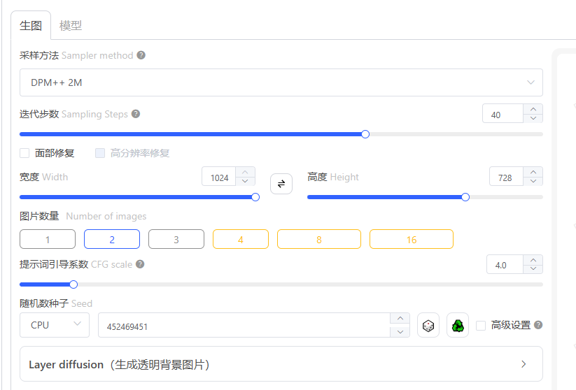
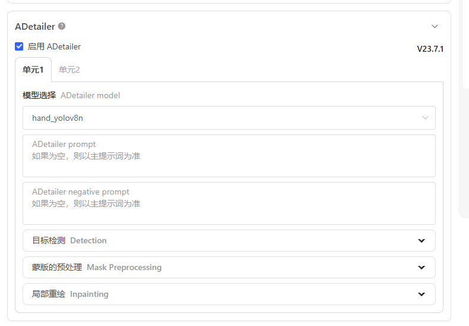

### **📸 图片标题**

**「治愈系微缩工业风！蓝白机械城沙盘太戳心～✨」**
*(附emoji版：🏭「谁懂啊！这个会发光的工业沙盘我能盯着看一整天…」)*

------

### **🏷️ 图片标签**

```
#微缩模型 #工业风设计 #模型摄影 #沙盘美学 #手工治愈时刻
```

------

### **📝 小红书风格描述文案**

**🌆 沉浸式开箱！**
*“刚收到这个蓝白配色的工业风沙盘模型，
细节控直接破防！！✨*

✅ **亮点速戳**：
▫️ 全亚克力材质建筑+荧光蓝管线，灯光一开秒变赛博工厂！
▫️ 迷你卡车居然是能滑动的！道路还用磨砂贴纸做了仿水泥质感
▫ 小心机：树是用苔藓粉+棉花捏的，近看还有「人工降雪」颗粒感

💡 **神仙用法**：
当桌面摆件/送男友生日礼/拍INS风静物照
（偷偷说：开柔光灯从斜上方打光，质感飙升200%！）

👀 **谁懂啊**！每次看到这些迷你机械和blingbling的灯光，
强迫症都被治愈了… 想把它裱进玻璃展柜的举手🙋♀️

**👉 点击主页看完整制作过程➡️ 手残党也能复刻的微缩场景教程！**

------

### **✨ 氛围感加分句式**

1. **「救命！这个角度拍出了宇宙空间站的既视感…」**
2. **「建议搭配《星际穿越》BGM食用，沉浸感拉满💫」**
3. **「同事以为我买了百万级沙盘… 其实成本不到一杯奶茶钱」**

------

### **📌 互动话术参考**

➤ *"猜猜左下角的迷你货车里装的是什么？揪3个宝送同款微缩车模！"*
➤ *"工业风VS田园风沙盘，你们PICK哪一款？"*
➤ *"评论区晒出你的治愈系小物，抽1人送模型材料包～"*

------

🛠️ **TIPS**：发布时建议搭配3:4竖构图，首图用「微距视角+移轴模糊」效果，第二张放俯拍全景图，第三张特写机械细节！


## 模型截图

(masterpiece, ultra-detailed, miniaturized scale model:1.3),industrial complex diorama,(blue and white plastic buildings:1.2),tiny trucks and vans on roads,miniature cranes and pipelines,mini trees with flocking texture,(neon accent lighting:1.1),toy-**** glossy surfaces,(tilt-shift blur:0.8),display case environment,overhead softbox lighting,miniature photography,8k sharp focus,
Negative prompt: (lowres, blurry:1.3),(realistic textures:1.5),human figures,(dusty surfaces:1.2),(metallic reflections:1.3),(natural shadows:1.4),photo background,(rugged surfaces:1.2),
Steps: 36, Size: 1024x1024, Seed: 452469451, Model: 基础算法V3.5 L 抢先哩布在线体验, Sampler: 7, CFG scale: 4

```
VAE	默认	klF8Anime2VAE_klF8Anime2VAE.ckpt	增强色彩饱和度
采样 DPM++2M
```


文生图

```
(masterpiece, ultra-detailed, miniaturized scale model:1.3),
industrial complex diorama,(blue and white plastic buildings:1.2),
tiny trucks and vans on roads,miniature cranes and pipelines,
mini trees with flocking texture,(neon accent lighting:1.1),
toy-like glossy surfaces,(tilt-shift blur:0.8),
display case environment,overhead softbox lighting,
miniature photography,8k sharp focus,
```

负向提示词 

```
(lowres, blurry:1.3),(realistic textures:1.5),
human figures,(dusty surfaces:1.2),
(metallic reflections:1.3),(natural shadows:1.4),
photo background,(rugged surfaces:1.2),
```



