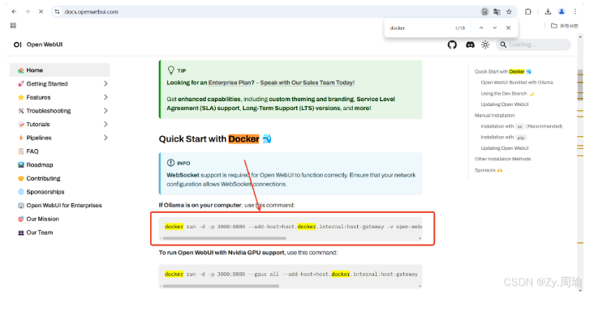
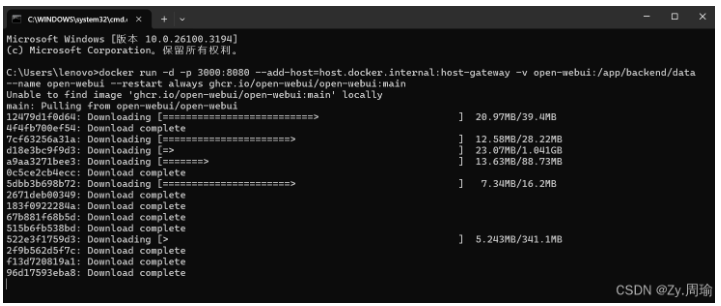
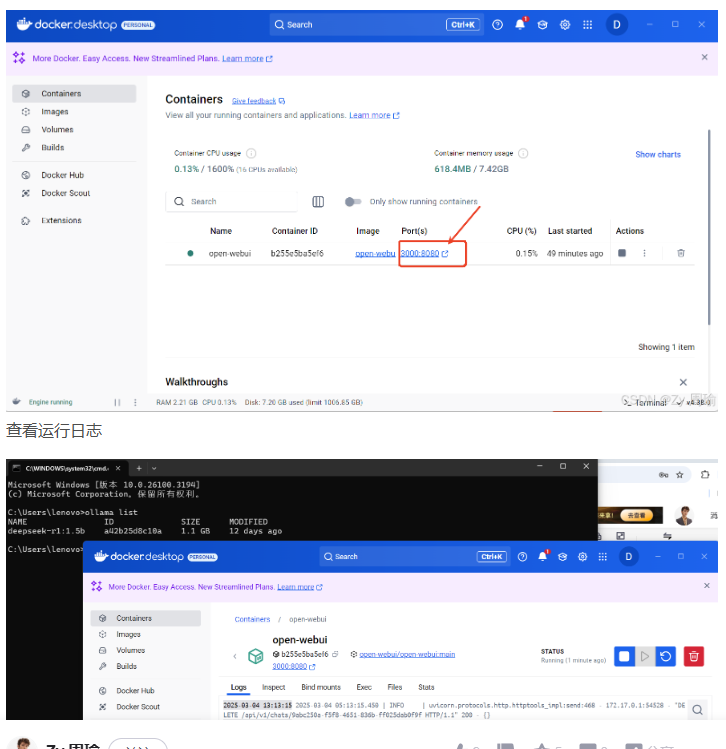
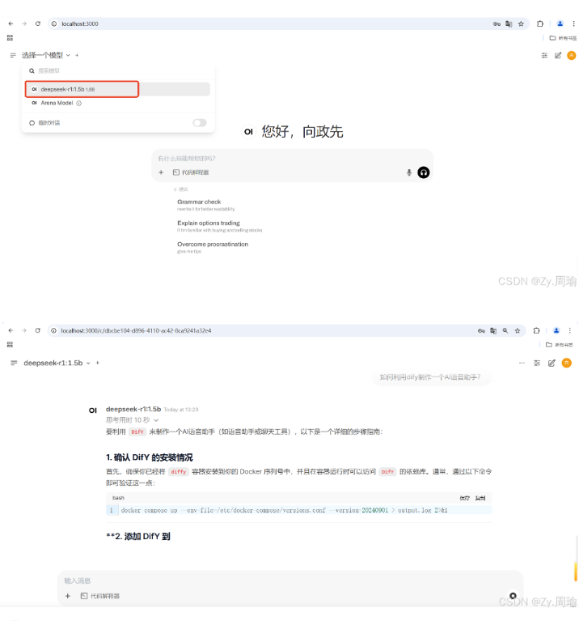

docker汉化：https://github.com/asxez/DockerDesktop-CN/tags

Ollama 安装包：https://ollama.com/

在ollama模型中下载对应的模型

https://ollama.com/search

#### 部署 Open WebUI

1. 进入官方文档 
    访问 🏡 Home | Open WebUI

  https://docs.openwebui.com/

2. 安装
打开命令行，输入复制的命令，等待安装完成

3. 运行Open-WebUI
双击docker的桌面图标，打开软件。点击红框端口，即可运行Open-WebUI

4. 与模型对话
    初次访问时，需要注册一个账号。这些信息会储存在你的电脑里。

  

在界面左上角，选择你的模型，就可以开始对话啦。

**一个平台，**

**接入全球大型语言模型**

https://dify.ai/zh

LobeChat 开启大脑集群，激发思维火花。你的智能助理，一直都在。

https://chat.shubiaobiao.com/welcome